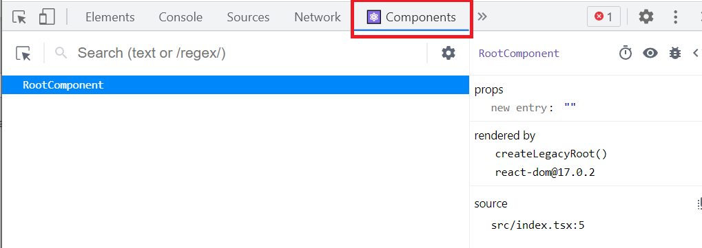

# Tools

## React Developer Tools for Chrome
The [React Developer Tools for Chrome](https://chrome.google.com/webstore/detail/react-developer-tools/fmkadmapgofadopljbjfkapdkoienihi?hl=en) adds a Components tab to Chrome that enables us to see the state of React components.

