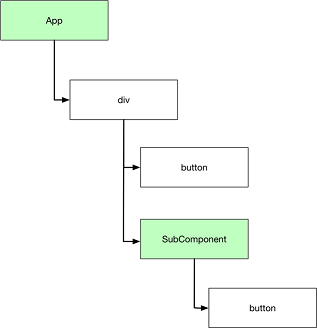

# Rendering Basics
To highlight the basics of React rendering this project contains a simple React app that consists of two components; a RootComponent and a Child Components. See [RootComponent.tsx](./src/RootComponent.tsx). We can visualize our components and the DOM elements logically as depicted in the following diagram.



If we open this app in Chrome and then bring up the Chrome dev tools on the Console tab we can observe  some important feature of react rendering. When the application starts, React asks each component to render its content. We can that the root App component function is invoked first which in turn causes the SubComponent function to be invoked. 

```
App
SubComponent
```

After rendering we say the application is in a **reconciled** state which means the rendered content is consistent with component state. React keeps a mapping between components and the DOM elements they render. 

## Mapping Between Components and DOM elements
Once in a reconciled state the app waits for change. Change is most likely caused by a call to a state's set method which updates the state. Once state is updated it is possibly inconsistent with the rendered DOM so setState marks the component and any child components as **stale**. If we click the button on the App to change its state then both the App and the SubComponent render methods are invoked. 

```
App
SubComponent
```

In order to decide whether to update the DOM react compares the content produced by components with cache of previous results knows as the **virtual DOM.** This mechanism prevents React from having to query the DOM to determine if anything has changed. This improves performance. 

```
SubComponent
```